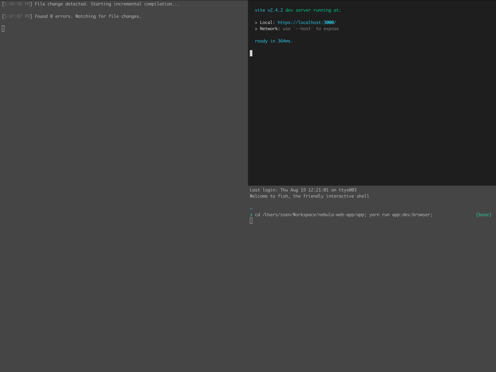
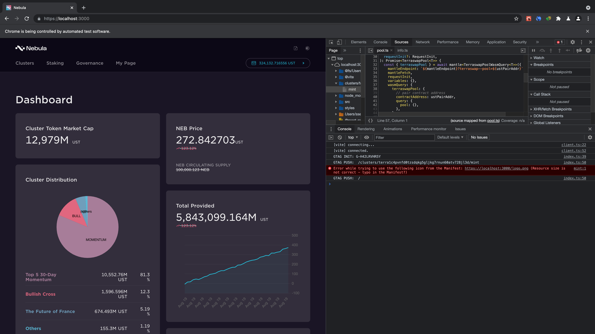

# Run development server

## Install node.js and yarn (macOS)

```sh
brew install node
npm install -g yarn
```

## Install iTerm2 (macOS)

<https://iterm2.com/>

If you run dev server without iTerm2, you can see 3 macOS default terminals.

## Get repository

```sh
git clone https://github.com/nebula-protocol/nebula-web-app.git
cd nebula-web-app
yarn install
cd app
yarn run start
```





# WORKSPACE TEMPLATE

## Start web project

```sh
# create a workspace directory
npx copy-github-directory workspace my-project
cd my-project

# create an app
npx copy-github-directory web my-app

# add "my-app" to workspaces of package.json

# install
yarn

# start
cd my-app

# start
yarn run start
```

## Start electron project

```sh
# create a workspace directory
npx copy-github-directory workspace my-project
cd my-project

# create an app
npx copy-github-directory electron my-app

# add "my-app" to workspaces of package.json

# install
yarn

# directory
cd my-app

# start
yarn run start
```

## Start multi-packages project

```sh
# create a workspace directory
npx copy-github-directory workspace my-project
cd my-project

# create an app
npx copy-github-directory packages my-packages

# add "my-packages" to workspaces of package.json

# install
yarn

# start
cd my-packages

# start
yarn run test
```
